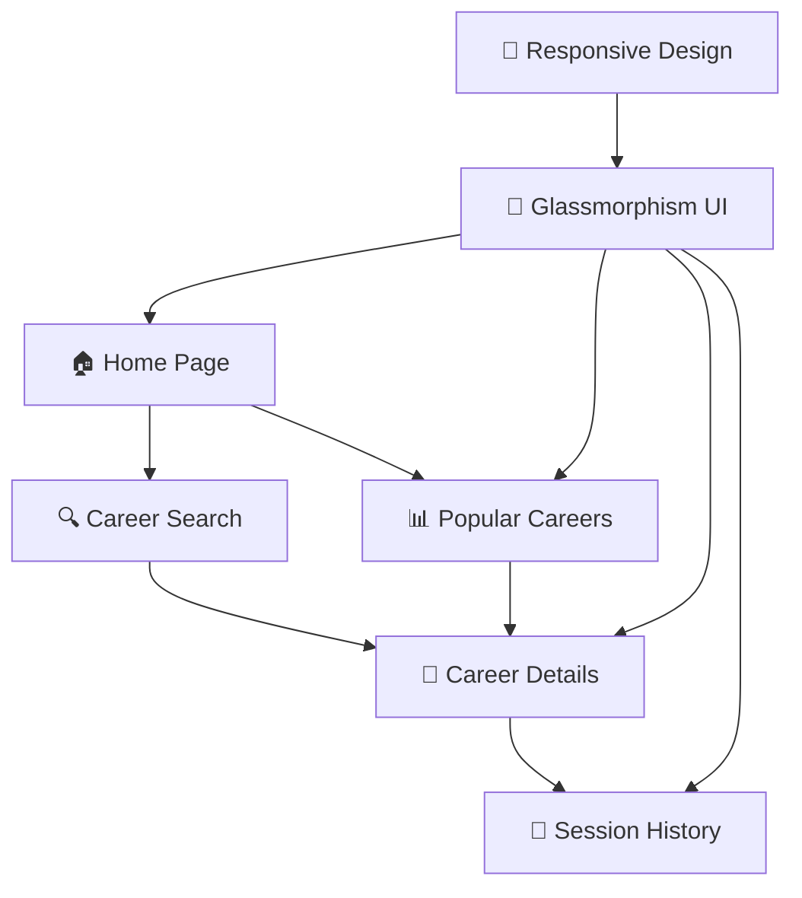

<div align="center">

# 🌟 PathFinder
### *Discover Your Dream Career Path in India*


<p align="center">
  <strong>🚀 A cutting-edge React.js career discovery platform featuring stunning glassmorphism design</strong>
</p>

<p align="center">
  <a href="https://career-path-finder.netlify.app" target="_blank">
    
  </a>
  <a href="https://github.com/sharmaram25/Career-PathFinder" target="_blank">
    
  </a>
  <a href="#" target="_blank">
    
  </a>
</p>

<p align="center">
  
  
  
  
  
</p>

<p align="center">
  
  
  
  
</p>

---

</div>

## 📚 Table of Contents
- [🎯 What is PathFinder?](#-what-is-pathfinder)
- [🏆 Key Highlights](#-key-highlights)
- [🛠️ Tech Stack](#️-tech-stack)
- [✨ Features](#-features)
- [🌟 Live Experience](#-live-experience)
- [🚀 Quick Start](#-quick-start)
- [📱 Application Architecture](#-application-architecture)
- [🎨 Design System & Customization](#-design-system--customization)
- [🔧 Configuration](#-configuration)
- [🚀 Deployment & Production](#-deployment--production)
- [📊 Data Architecture & API](#-data-architecture--api)
- [🤝 Contributing & Community](#-contributing--community)
- [📞 Support & Connect](#-support--connect)
- [📄 License & Legal](#-license--legal)

---

## 🎯 **What is PathFinder?**

PathFinder is a **revolutionary career discovery platform** specifically crafted for the Indian job market. Built with React 18 and featuring a breathtaking glassmorphism UI, it empowers users to explore **40+ career paths** with comprehensive insights on skills, salaries, and growth opportunities.

> *"Your dream career is just a search away"* ✨

### 🏆 **Key Highlights**
- 🔍 **Smart Career Search** - AI-powered search with intelligent filtering
- 🎨 **Glassmorphism Design** - Modern, frosted-glass aesthetic with stunning gradients
- 📊 **Real-time Data** - Up-to-date salary ranges and market trends
- 🕒 **Session History** - Track your exploration journey seamlessly
- 📱 **Responsive Design** - Perfect experience across all devices
- ⚡ **Lightning Fast** - Built with Vite for optimal performance
- 🎯 **Indian Market Focus** - Tailored specifically for Indian job landscape

## 🛠️ Tech Stack
- **Frontend:** React 18 + Vite
- **Styling:** Tailwind CSS (with custom glassmorphism utilities)
- **Routing:** React Router DOM
- **State Management:** React Context API
- **Icons:** Lucide React
- **Data Storage:** JSON files (no external database)

## ✨ Features

<table>
<tr>
<td width="50%">

### 🔍 **Core Features**
- **Smart Career Search** - Advanced filtering and search algorithms
- **40+ Career Paths** - Comprehensive career database
- **Real-time Data** - Updated salary ranges and market trends
- **Session History** - Track your exploration journey
- **Popular Careers** - Trending career paths in India
- **Responsive Design** - Seamless mobile & desktop experience

</td>
<td width="50%">

### 🎨 **UI/UX Features**
- **Glassmorphism Design** - Modern frosted-glass aesthetic
- **Gradient Backgrounds** - Beautiful color transitions
- **Smooth Animations** - Engaging hover and transition effects
- **Dark/Light Theming** - Adaptive color schemes
- **Interactive Elements** - Dynamic cards and buttons
- **Accessibility** - WCAG compliant design

</td>
</tr>
</table>

### 🚀 **Performance & Technical**
- ⚡ **Lightning Fast** - Built with Vite for optimal performance
- 📱 **Mobile-First** - Responsive design across all devices
- 🔒 **Type Safe** - TypeScript ready architecture
- 🎯 **SEO Optimized** - Meta tags and structured data
- 🌐 **PWA Ready** - Progressive web app capabilities
- 📊 **Analytics Ready** - Easy integration with tracking tools

## 🌟 **Live Experience**

<div align="center">

### 🚀 **Ready to Explore?**

<p align="center">
  <a href="https://career-path-finder.netlify.app" target="_blank">
    
  </a>
  <a href="https://github.com/sharmaram25/Career-PathFinder" target="_blank">
    
  </a>
</p>

**Experience the future of career discovery with our cutting-edge glassmorphism interface!**

*Discover 40+ career paths • Real-time salary data • Interactive skill mapping • Session-based history*

</div>

## 🚀 **Quick Start**

### ⚡ **Get Up and Running in 3 Steps**

```bash
# 1️⃣ Clone the repository
git clone https://github.com/sharmaram25/Career-PathFinder.git
cd PathFinder

# 2️⃣ Install dependencies
npm install

# 3️⃣ Launch development server
npm run dev
```

### 🏗️ **Build for Production**
```bash
npm run build
npm run preview  # Preview production build locally
```

<div align="center">
<table>
<tr>
<td align="center"><strong>🔧 Development</strong></td>
<td align="center"><strong>🚀 Production</strong></td>
<td align="center"><strong>📦 Preview</strong></td>
</tr>
<tr>
<td align="center"><code>npm run dev</code></td>
<td align="center"><code>npm run build</code></td>
<td align="center"><code>npm run preview</code></td>
</tr>
</table>
</div>

## 🌐 Live Demo
Check out the live app: [career-path-finder.netlify.app](https://career-path-finder.netlify.app)

## 📞 **Support & Connect**

<div align="center">

### 💬 **Get Help & Support**
For support, questions, or feedback, don't hesitate to reach out!

<p align="center">
  <a href="mailto:sharmaram2504@gmail.com">
    
  </a>
  <a href="https://github.com/sharmaram25/Career-PathFinder/issues">
    
  </a>
</p>

### 🌐 **Connect with the Creator**

<table align="center">
<tr>
<td align="center">
  <a href="https://github.com/sharmaram25">
    
  </a>
</td>
<td align="center">
  <a href="https://www.linkedin.com/in/ram-sharma-20rs02">
    
  </a>
</td>
</tr>
<tr>
<td align="center">
  <a href="https://www.instagram.com/ramsharma.25">
    
  </a>
</td>
<td align="center">
  <a href="mailto:sharmaram2504@gmail.com">
    
  </a>
</td>
</tr>
</table>

</div>

---

<div align="center">

### 🙏 **Acknowledgments & Credits**

**Built with ❤️ by [Ram Sharma](https://github.com/sharmaram25)**

*Special thanks to:*
- **[Lucide React](https://lucide.dev/)** for beautiful icons
- **[Tailwind CSS](https://tailwindcss.com/)** for utility-first styling
- **[React Community](https://reactjs.org/)** for the amazing ecosystem
- **[Vite Team](https://vitejs.dev/)** for lightning-fast development
- **Open Source Community** for inspiration and tools

</div>

## 📦 Available Scripts

- `npm run dev` - Start development server
- `npm run build` - Build for production
- `npm run preview` - Preview production build
- `npm run lint` - Run ESLint

## 🎨 **Design System & Customization**

### 🌈 **Glassmorphism Theme**
Our signature design language features:
- **Backdrop Blur Effects** - Frosted glass aesthetics with `backdrop-blur-md`
- **Gradient Overlays** - Multi-layered color transitions
- **Semi-transparent Elements** - Perfect balance of opacity and visibility
- **Smooth Animations** - Buttery transitions on hover and focus states

### 🎯 **Color Palette**
```css
/* Primary Gradients */
--gradient-primary: linear-gradient(135deg, #667eea 0%, #764ba2 100%);
--gradient-secondary: linear-gradient(135deg, #f093fb 0%, #f5576c 100%);
--gradient-accent: linear-gradient(135deg, #4facfe 0%, #00f2fe 100%);

/* Glassmorphism Variables */
--glass-bg: rgba(255, 255, 255, 0.1);
--glass-border: rgba(255, 255, 255, 0.2);
--glass-shadow: 0 8px 32px rgba(31, 38, 135, 0.37);
```

### 🛠️ **Custom Tailwind Utilities**
Pre-built classes for rapid development:
- `glassmorphism` - Standard glass effect
- `glassmorphism-card` - Enhanced card styling  
- `glassmorphism-nav` - Navigation-specific glass
- `gradient-primary` - Primary gradient background
- `hover-lift` - Smooth lift animation on hover

<div align="center">

**🎨 [View Design System](https://career-path-finder.netlify.app)** | **⚙️ [Customize Themes](./src/index.css)**

</div>

## 📱 **Application Architecture**

<div align="center">



</div>

### 🏗️ **Project Structure**
```
src/
├── 📁 components/
│   ├── 🎨 common/         # Reusable UI components
│   ├── 🏗️ layout/         # Navigation & Footer
│   └── 📄 pages/          # Main application pages
├── 🔄 context/            # React Context providers
├── 📊 data/               # Career database (JSON)
├── 🪝 hooks/              # Custom React hooks
└── 🛠️ utils/              # Helper functions
```

### 🎯 **Core Components**

<table>
<tr>
<td width="33%">

**🏠 Pages**
- `Home.jsx` - Landing & search
- `Popular.jsx` - Trending careers
- `CareerDetails.jsx` - Career info
- `History.jsx` - Session tracking
- `About.jsx` - Company info

</td>
<td width="33%">

**🎨 UI Components**
- `SearchBar.jsx` - Smart search
- `CareerDropdown.jsx` - Category filter
- `TagCloud.jsx` - Skill visualization
- `Navbar.jsx` - Navigation
- `Footer.jsx` - Contact links

</td>
<td width="33%">

**🔄 State Management**
- `CareerContext.jsx` - Career data
- `HistoryContext.jsx` - User sessions
- React Router - Navigation
- Local Storage - Persistence

</td>
</tr>
</table>

## 🔧 Configuration

### Tailwind CSS
Custom utilities for glassmorphism effects are defined in `tailwind.config.js`:
- `glassmorphism` - Standard glass effect
- `glassmorphism-card` - Card-specific glass effect
- `glassmorphism-nav` - Navigation glass effect

### Context Providers
- `CareerContext` - Manages career data and search functionality
- `HistoryContext` - Handles session-based history tracking

## 🚀 **Deployment & Production**

### 🌐 **Netlify Deployment** (Recommended)

<div align="center">

[](https://app.netlify.com/start/deploy?repository=https://github.com/sharmaram25/Career-PathFinder)

</div>

**Automated Deployment:**
1. Connect your GitHub repository to Netlify
2. Build command: `npm run build`
3. Publish directory: `dist`
4. Automatic deployments on every push to main branch

**Manual Deployment:**
```bash
# Build the project
npm run build

# Deploy the dist folder to Netlify
# Or use Netlify CLI: netlify deploy --prod --dir=dist
```

### ⚙️ **Environment Configuration**

Create a `netlify.toml` file for optimal deployment:
```toml
[build]
  publish = "dist"
  command = "npm run build"

[[redirects]]
  from = "/*"
  to = "/index.html"
  status = 200
```

### 🔧 **Performance Optimizations**
- ⚡ **Vite Build** - Lightning-fast bundling with ES modules
- 🗜️ **Asset Compression** - Automatic minification and tree-shaking
- 📱 **Progressive Loading** - Lazy-loaded components and images
- 🎯 **SEO Optimization** - Meta tags and structured data
- 📊 **Bundle Analysis** - Use `npm run build -- --analyze` for insights

## 📊 **Data Architecture & API**

### 🗃️ **Career Database Structure**
```json
{
  "id": "software-engineer",
  "title": "Software Engineer",
  "category": "Technology",
  "description": "Build and maintain software applications...",
  "skills": ["JavaScript", "React", "Node.js", "Python"],
  "salary": {
    "entry": "₹3-6 LPA",
    "mid": "₹8-15 LPA", 
    "senior": "₹18-35 LPA"
  },
  "education": ["B.Tech/BE in CS", "MCA", "Coding Bootcamp"],
  "growth_path": ["Junior → Senior → Lead → Architect"],
  "market_demand": "High",
  "remote_friendly": true
}
```

### 🔍 **Search & Filter Capabilities**
- **Fuzzy Search** - Intelligent matching across titles and skills
- **Category Filtering** - Technology, Healthcare, Finance, Creative, etc.
- **Salary Range Filtering** - Filter by expected compensation
- **Experience Level** - Entry, Mid-level, Senior positions
- **Remote Work Options** - Filter remote-friendly careers

### 📈 **Analytics & Insights**
- **Popular Searches** - Track trending career interests
- **Session History** - User exploration patterns
- **Market Trends** - Real-time job market data
- **Skill Demand** - Most requested technical skills

## 🤝 **Contributing & Community**

We welcome contributions from developers of all skill levels! Here's how you can help improve PathFinder:

### 🌟 **Ways to Contribute**
- 🐛 **Bug Reports** - Found an issue? Let us know!
- ✨ **Feature Requests** - Have an idea? We'd love to hear it!
- 🔧 **Code Contributions** - Submit PRs for fixes and enhancements
- 📖 **Documentation** - Help improve our docs and examples
- 🎨 **Design Improvements** - Enhance the UI/UX experience

### 🚀 **Development Workflow**
```bash
# 1. Fork the repository on GitHub
git clone https://github.com/your-username/Career-PathFinder.git

# 2. Create a feature branch
git checkout -b feature/amazing-new-feature

# 3. Make your changes and test thoroughly
npm run dev  # Test your changes

# 4. Commit with descriptive messages
git commit -m "✨ Add amazing new feature for better UX"

# 5. Push and create a Pull Request
git push origin feature/amazing-new-feature
```

### 📋 **Contribution Guidelines**
- Follow the existing code style and conventions
- Write descriptive commit messages with emojis
- Test your changes thoroughly before submitting
- Update documentation if needed
- Be respectful and collaborative in discussions

<div align="center">

**🤝 [Join Our Community](https://github.com/sharmaram25/Career-PathFinder/discussions)** | **🐛 [Report Issues](https://github.com/sharmaram25/Career-PathFinder/issues)**

</div>

## 📄 **License & Legal**

<div align="center">

### 📜 **MIT License**

This project is licensed under the MIT License - see the [LICENSE](LICENSE) file for details.

```
Copyright (c) 2025 Ram Sharma

Permission is hereby granted, free of charge, to any person obtaining a copy
of this software and associated documentation files (the "Software"), to deal
in the Software without restriction, including without limitation the rights
to use, copy, modify, merge, publish, distribute, sublicense, and/or sell
copies of the Software...
```

**🔓 Free to use • ✅ Commercial use allowed • 🔄 Modify and distribute**

</div>

---

<div align="center">

### ⭐ **Star This Project**

If PathFinder helped you discover new career opportunities, please consider giving it a star! ⭐

<p align="center">
  <a href="https://github.com/sharmaram25/Career-PathFinder">
    
  </a>
  <a href="https://github.com/sharmaram25/Career-PathFinder/fork">
    
  </a>
</p>

**Made with 💖 in India | Empowering careers since 2025**

</div>
